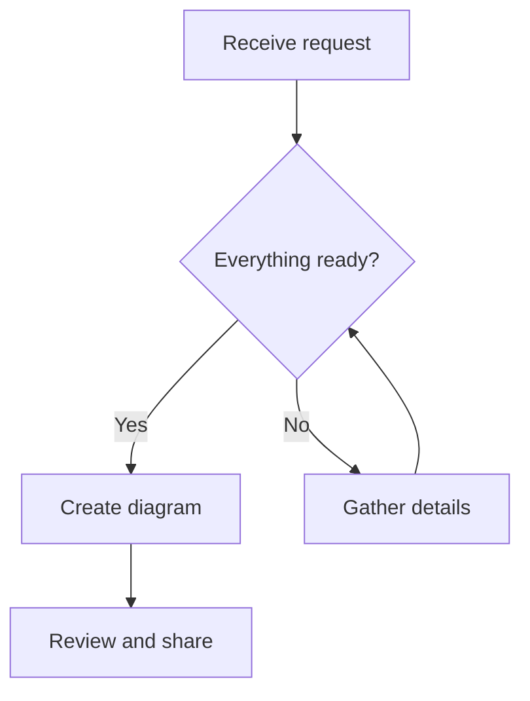

# Flow Studio

Turn Mermaid flowchart code into an editable Excalidraw drawing. Preview the structure, create a canvas draft, move and style individual shapes, then download JPEG or SVG output. Keep the source and edited drafts together in a project backup.

This is a local browser application prototype. No application account, API key, AI provider, database, or backend service is required. Access to this private GitHub repository is required to clone it.

## Technology stack

Versions below are pinned in `package.json`; `package-lock.json` records the dependency tree.

| Technology | Version | Purpose |
| --- | --- | --- |
| React / React DOM | 19.0.0 | Application UI and state |
| Excalidraw | 0.18.0 | Editable canvas and image export |
| Mermaid | 11.12.0 | Flowchart syntax and SVG preview |
| Mermaid to Excalidraw | 1.1.2 | Converts Mermaid into drawing elements |
| Vite | 6.1.0 | Development server and production build |
| JavaScript ES modules / JSX | — | Application implementation |
| CSS | — | Layout and styling |
| Browser localStorage | — | Local project persistence |
| Node.js test runner | — | Unit tests with `node:test` and `node:assert/strict` |

## Setup and run

You need Git, Node.js with npm, and a modern browser. The existing development environment uses Node.js 22.15.0. Use a compatible Node.js 22 installation for these instructions.

1. Clone the repository using a GitHub account with access:

   ```sh
   git clone https://github.com/coachtoughguy/flow-studio.git
   cd flow-studio
   ```

2. Install the locked dependencies:

   ```sh
   npm ci
   ```

3. Start the local development server:

   ```sh
   npm run dev
   ```

4. Open the local URL printed by Vite, usually `http://127.0.0.1:5173`. Keep the terminal running while using the app. Press `Ctrl+C` in the terminal to stop it.

The server binds to `127.0.0.1`. No `.env` file or credentials are needed to run Flow Studio. On Windows, if PowerShell blocks or misresolves `npm`, use `npm.cmd` in the commands above.

## Create your first diagram

### 1. Write or paste Mermaid

Open **1. Structure** and paste this into **Mermaid code**:



The preview updates after a short pause. Wait for **Ready to convert**. Fix syntax errors shown in the preview before continuing.

Use `flowchart` or `graph` with a direction: `TD`/`TB` (top to bottom), `BT` (bottom to top), `LR` (left to right), or `RL` (right to left). This app currently accepts flowcharts only.

### 2. Alternatively, start from plain steps

Click **Start from steps**, enter two to thirty steps, and click **Generate Mermaid**:

```text
Receive request
Review request
Send response
```

You can also separate steps with `then` or `→`. This feature uses deterministic local text conversion: it creates a linear flow and does not call an AI service. Add decisions, branches, and loops by editing the generated Mermaid code. Generating replaces the current source text; existing canvas drafts remain.

### 3. Convert and edit

1. Click **Continue to Excalidraw** after the preview is ready.
2. In **2. Finish & export**, select and move shapes, edit labels, or change colors with the embedded editor controls.
3. Use **Fit drawing** to bring the scene into view.
4. Use **Canvas draft** to switch between saved drafts.

Each conversion creates a new draft. Returning to **1. Structure**, changing the code, and converting again preserves earlier canvas drafts. Canvas edits do not rewrite the Mermaid source, and source edits do not update an existing canvas automatically. Subgraph elements are made individually selectable during conversion.

### 4. Export or back up

| Action | Output | Use |
| --- | --- | --- |
| **Download JPEG** | Current draft as `.jpg` | Raster image for documents and sharing |
| **Download SVG** | Current draft as `.svg` | Scalable vector image |
| **Download project** | `flow-studio.flow.json` | Source and all editable drafts for later restoration |

Image exports include the canvas background and 24 pixels of padding. JPEG export uses quality `0.95` and caps the longest dimension at 4096 pixels. Keep a project JSON backup when you need to resume editing; image exports are not Flow Studio project backups.

## Save and reopen projects

The app automatically saves the current source and drafts to the browser's localStorage under `flow-studio-project-v1`. Watch the save status near **Open project**. A save is scheduled 350 milliseconds after changes, with another save attempt on the browser's `pagehide` event when leaving the page.

To restore a downloaded backup, click **Open project** and select your Flow Studio JSON file. Imported drafts receive new IDs and an `(imported)` suffix, and are merged with existing drafts. The imported project's source becomes the current source editor text. Repeated imports add additional copies.

Local storage belongs to a browser profile and origin. Use the same protocol, hostname, and port to return to the same saved project. Switching between `localhost` and `127.0.0.1`, changing ports, using a different browser profile, or clearing site data can make previous work unavailable. Download backups before changing environments.

## Commands

Run these from the repository root:

```sh
# Run unit tests
npm test

# Build static production assets into dist/
npm run build

# Serve the production build locally for inspection
npx vite preview --host 127.0.0.1
```

Open the URL printed by the preview command. Build first; there is no `npm run preview` script. Production hosting requires serving `dist/` through a static web server. Repository creation does not deploy the application.

The four current unit tests cover source normalization and flowchart detection, malformed project rejection, JSON round-trip preservation, and escaping/validation in local step generation. They do not constitute browser end-to-end coverage.

## How the application works

1. React holds the source, preview status, and canvas drafts.
2. After a 400-millisecond debounce, Mermaid renders an SVG preview. Revision checks prevent older results from replacing the current preview.
3. Explicit conversion parses the source into Excalidraw elements. The app rejects stale conversion results, empty output, and image fallback output.
4. The embedded Excalidraw editor sends scene changes back into the selected draft.
5. The app serializes source and drafts into localStorage or downloadable JSON; image exports are generated in the browser.

`validateProject` checks imported and restored project structure, drawing properties, image data URLs, and canvas settings. The stored format has `version: 1`, a current `source`, and a `drafts` array. Each draft includes its ID, name, source snapshot, elements, embedded files, and saved canvas settings.

## Project layout

```text
src/
  main.jsx           React UI, conversion, canvas, persistence, import/export
  project.js         Source helpers, project validation, local step generation
  style.css          Application styling
tests/
  project.test.js    Unit tests
index.html           Browser entry point
vite.config.js       Local server and build configuration
package.json         Dependencies and commands
package-lock.json    Locked dependency tree
PRODUCT.md           Product scope
DESIGN.md            Visual direction
HANDOFF.md           Original investigation and proposed handoff contract
```

`HANDOFF.md` includes historical observations of the hosted upstream editor and references an optional local `upstream/` snapshot. That snapshot is excluded from this repository and is not needed to run the app. Treat the current source and tests as the description of implemented behavior.

## Limits and troubleshooting

| Situation | Explanation / action |
| --- | --- |
| Conversion button disabled | Wait for a current valid preview; fix invalid or empty source. |
| Sequence/class/other diagram rejected | This prototype supports flowcharts only. |
| Specialized shape changes appearance | The converter can simplify shape styling or geometry. Inspect the resulting canvas. |
| Image fallback rejected | Simplify the diagram so it converts entirely into editable shapes. |
| Code changed during conversion | Wait for the new preview, then convert again. |
| Source too large | The source limit is 50,000 characters. |
| Too many drafts | Conversion and import enforce a total of 100 drafts. There is no dedicated draft-delete or new-project control. Back up before managing browser data. |
| Project import rejected | Use a valid Flow Studio project JSON file no larger than 20 MiB; arbitrary JSON and native `.excalidraw` files are not this import format. |
| Local save failed | Browser storage may be unavailable or full. Download a project backup immediately. |
| Local saving paused | Saved data could not be parsed or validated. The app preserves that stored value and pauses writes for the session; download current work before investigating. |
| JPEG export fails | Try a smaller drawing; export requires a nonempty scene. |
| Clone authentication fails | Git requires separate working GitHub credentials; being signed in to a browser or connector does not necessarily authenticate terminal Git. |
| Port already in use | Open the actual URL printed by Vite. A different port uses separate browser storage. |

Desktop editing is the primary workflow. The source and preview stack on narrow windows, but extensive mobile and large-diagram testing is not provided.

## Privacy and authentication

Flow Studio implements no application login, sessions, OAuth, access tokens, or server-side authorization. Its own source contains no application API calls. Rendering, conversion, step generation, and project processing happen in the browser; dependencies may load assets or embedded content, so this is not a guarantee of fully offline operation.

Saved projects and JSON backups are not encrypted by the app. Do not treat browser storage as a secure vault. Mermaid is initialized with strict security mode and HTML labels disabled. The Vite development configuration denies serving `.env` files, Git metadata, and the optional upstream snapshot; this is not a production access-control system.

`node_modules/`, `dist/`, `.env*`, and `upstream/` are excluded from Git. No project license file has been added; dependency licenses remain applicable to their respective packages.
